# 🎵 Cue Sheet Audio Format Updater

## 📌 Overview
A robust Rust utility that **automatically updates `.cue` sheet references** when migrating from WAV to lossless formats (FLAC/APE). This tool recursively processes cue files in your music library, intelligently replacing `.wav` references based on actual audio files present in each directory.

## ⚙️ Core Functionality

```mermaid
graph TD
    A[Start in Current Directory] --> B{Recursive Scan}
    B --> C[Find .cue Files]
    C --> D{Check Directory Contents}
    D -->|FLAC files exist| E[Replace .wav → .flac]
    D -->|APE files exist| F[Replace .wav → .ape]
    E --> G[Preserve Original Encoding]
    F --> G
    G --> H[In-Place Update]
```


### Key Features
- **Intelligent Format Detection**:  
  Automatically selects replacement format based on actual files present:
  - Prioritizes `.flac` if any FLAC files exist in the directory
  - Falls back to `.ape` if APE files exist (and no FLACs)
  - Skips directories with neither format
  
- **Encoding-Aware Processing**:  
  Handles legacy cue sheets with proper encoding detection:
  1. Tries UTF-8 decoding first
  2. Falls back to Windows-1252 (common for Windows-created cue sheets)
  3. Preserves original character encoding in output
  
- **Recursive Directory Traversal**:  
  Processes all subdirectories depth-first starting from execution point

- **Atomic Updates**:  
  Only modifies files when actual changes are needed (no unnecessary writes)

## 🛠️ Technical Implementation
```rust
// Core workflow pseudocode
fn process_cue_file(path) {
    content = detect_encoding_and_read(path); // UTF-8 → Win1252 fallback
    
    if directory_contains("*.flac") {
        content.replace(".wav", ".flac"); 
    } else if directory_contains("*.ape") {
        content.replace(".wav", ".ape");
    }
    
    if content_changed { 
        write_with_original_encoding(path, content); 
    }
}
```

### Critical Design Choices
1. **Case-Sensitive Replacement**  
   Only replaces lowercase `.wav` (common in cue sheets) - avoids unintended replacements in metadata
   
2. **Directory Context Awareness**  
   Checks *actual files present* before making replacements - prevents broken references
   
3. **Encoding Preservation**  
   Maintains original character encoding through Windows-1252 fallback handling
   
4. **Minimal-Impact Updates**  
   Skips unchanged files and avoids backup clutter (intentional design choice)

## ⚠️ Important Limitations
| Consideration | Impact | Mitigation |
|---------------|--------|------------|
| **No backups created** | Original files overwritten | Use with version control or manual backups |
| **Only replaces `.wav`** | Won't fix `.WAV` or mixed case | Pre-process files with case normalization |
| **String-based replacement** | May replace in comments | Verify critical cue sheets manually |
| **FLAC priority** | Prefers FLAC even if APE is primary | Organize libraries by format type |

## 🚀 Usage Instructions
You can donwload binary from repo, build locally, or build inside docker (linux, windows). Docker-compose build up - generates windows executable by default (target\x86_64-pc-windows-gnu\release\cue_editor.exe).

## 🔒 Safety Recommendations
1. **Test first** on a small directory subset
2. **Version control**: Run in a Git-tracked directory (`git add . && git commit -m "pre-update"`)
3. **Verify critical albums** after processing:
   ```bash
   grep -r "\.wav" . --include=*.cue  # Check for missed replacements
   ```
4. **Combine with verification tools** like `cuetools` for integrity checks

> **💡 Pro Tip**: For large libraries, pair with `rclone` or `restic` to create point-in-time snapshots before processing.

## 📦 Dependencies
- `encoding_rs` crate for robust Windows-1252 handling
- Standard Rust filesystem and encoding libraries
- No external system dependencies required
